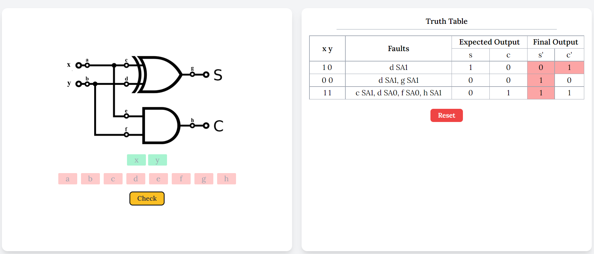

## Design of Digital Systems Lab
## Detection of both SA0 and SA1 faults on a Half Adder circuit

#### Simulator Link : (https://aniketh-bellala.github.io/DDS-Mini-Project-v2/simulation/)

## Aim
To realise Half Adder Circuit using AND and XOR gates and to detect all the possible positions of SA0 and SA1 faults in Half Adder Circuit

## Theory
### Half-Adder

A half-adder is a combinational circuit that is used to add two binary digits. This simple addition consists of four possible elementary operations, namely, 0+0=0, 0+1=1, 1+0=1 and 1+1=10. The first three operations produce a sum that is one bit long, but when both augend and addend bits are equal to logical 1, the binary sum consists of two digits. The higher significant bit of this result is called a carry. When the augend and addend numbers contain more significant digits, the carry obtained from the addition of two bits is added to the next higher-order pair of significant bits.

The half adder is named so due to the fact that two half adders can be employed to implement a full adder. It needs two input and two output bits. The input variables designate the augend and addend bits, while the output bits produce the sum and the carry.

The truth table of the half adder is shown in table - 1. The inputs are designated as x and y, while the S represents the sum output and the C represents the carry output.

    <table>
        <thead>
            <tr>
                <th colspan="2">Input</th>
                <th colspan="2">Output</th>
             </tr>
        </thead>
        <tbody>
            <tr>
                <td>A</td>
                    <td>B</td>
                    <td>S</td>
                    <td>C</td>
            </tr>
            <tr>
                <td>0</td>
                <td>0</td>
                <td>0</td>
                <td>0</td>
            </tr>
            <tr>
                <td>0</td>
                <td>1</td>
                <td>1</td>
                <td>0</td>
            </tr>
            <tr>
                <td>1</td>
                <td>0</td>
                <td>1</td>
                <td>0</td>
            </tr>
            <tr>
                <td>1</td>
                <td>1</td>
                <td>0</td>
                <td>1</td>
            </tr>
        </tbody>
    </table>
    <figcaption style="font-size: 14px;margin-top: -8px;margin-bottom: 8px;"> Table - 1: Half Adder Truth Table</figcaption>

The carry output is 0 unless both the inputs are 1. The S(sum) output represents the least significant bit of the addition operation.

The simplified Boolean expressions for the two outputs can be obtained directly from the truth table. They are:

S = x ⊕ y

C = xy 

Thus, the sum is the result of performing an EXOR operation on the input variables, while the carry output is obtained by ANDing the two input variables. We can therefore use an exclusive-OR gate and an AND gate to implement the half adder circuit as shown on figure - 1.

<figcaption style="font-size: 14px;margin-top: 5px;"> Figure - 1: Half Adder Circuit</figcaption>

### SA Fault

A fault is, as the name suggests, a defect in the circuit. It implies something is wrong with the circuit. More often than not, a fault in a circuit is not good news.

But sometimes, the developers induce a fault at some point in the circuit. This helps in ensuring that there is no fault at any other possible points. In this way, faults help us while designing a circuit.

A stuck-at fault (SAF) occurs when the value of some wire is stuck on a particular value. Irrespective of the value given to the wire, it is always at either logical 1 or logical 0. Stuck-at faults are of two types – stuck-at-1 (SA1) and stuck-at-0 (SA0).

Stuck-at-1 fault occurs when the value of a particular wire is always at logical 1 irrespective of the value fed to the wire. If it is always at logical 0, then it is called stuck-at-0 fault.

For example if there is SA1 fault in position a, then output will be as shown in table - 2. Here value marked with red background indicated as faulty output.

<figcaption style="font-size: 14px;margin-top: 5px;"> Figure - 2: Half Adder Circuit with faults positions</figcaption>

###

    <table>
        <thead>
            <tr>
                <th colspan="2">Input</th>
                <th colspan="2">Expected Output</th>
                <th colspan="2">Final Output</th>
             </tr>
        </thead>
        <tbody>
            <tr>
                <td>A</td>
                <td>B</td>
                <td>S</td>
                <td>C</td>
                <td>S'</td>
                <td>C'</td>
            </tr>
            <tr>
                <td>0</td>
                <td>0</td>
                <td>0</td>
                <td>0</td>
                <td bgcolor = "#FCA5A5">1</td>
                <td>0</td>
            </tr>
            <tr>
                <td>0</td>
                <td>1</td>
                <td>1</td>
                <td>0</td>
                <td bgcolor = "#FCA5A5">0</td>
                <td bgcolor = "#FCA5A5">1</td>
            </tr>
            <tr>
                <td>1</td>
                <td>0</td>
                <td>1</td>
                <td>0</td>
                <td>1</td>
                <td>0</td>
            </tr>
            <tr>
                <td>1</td>
                <td>1</td>
                <td>0</td>
                <td>1</td>
                <td>0</td>
                <td>1</td>
            </tr>
        </tbody>
    </table>
    <figcaption style="font-size: 14px;margin-top: -8px;margin-bottom: 8px;"> Table - 2: Truth Table with SA1 fault</figcaption>

## Procedure
##### To get the output for SA0 or SA1 faults on a specific position -

1. Set the input of x and y. Here x and y can be either 0 or 1.
2. To enable fault in any position, I.e., faults on a, b, c, d, e, f, g, or on position h - input fault type.
3.  For SA0 - the fault type should be 0; for SA1 - it should be 1.
4. Click on the Check button to get the result on the truth table.
5. Final output marked with red denotes faulty output.
6. For further simulation - repeat steps from 1 to 4.

## Pre Test
#### Please attempt the following questions

Q 1. What is the role of half adder in the parts of a processor?  

a) Increment and decrement operators  

b) Calculate addresses  

c) Calculate table indices  

d) All of the above 

Q 2. Which of the following options are false with respect to half adders?
a) Can accept a carry bit from a previous stage 

b) Can accept a carry bit from a present stage  

c) Can accept a carry bit from a next stage 

d) Can accept a carry bit from the following stages

Q 3. How many digits can the half adder circuit add at a time?  

a) 3 

b) 0  

c) 2   

d) 1  

Q 4. Total number of inputs and outputs in a half adder are 

a) 2, 2

b) 3, 1  

c) 4, 0 

d) 2, 1  

Q 5. How many half adders are used to design a full adder? 

a) 1 

b) 3

c) 4

d) 2 

### Post Test

Q 1. Which of the following are single-stuck at faults?              

a. SA0   

b. SA1  

c. Both A and B

d. None of the Above    

Q 2. How many AND, OR and EXOR gates are required for the configuration of half adder?   

a. 1, 1, 0 

b. 1, 2, 0   

c. 0, 1, 2  

d. 1, 0, 1  

Q 3. If A and B are the inputs of a half adder, the sum and carry are given by  

a. A NAND B, A OR B  

b. A OR B, A NAND B

c. A Ex-OR B, A AND B 

d. A AND B, A XOR B 

Q 4. Total number of possible faults in a half adder is __________   

a. 6 

b. 9 

c. 7

d. 8  

Q 5. What are the outputs(sum,carry) when the inputs are SA0? 

a. 0, 0

b. 0, 1

c. 1, 0

d. 1, 1

### References
1. Digital Design with an Introduction to the Verilog HDL, VHDL, and SystemVerilog, M.
Morris Mano and Michael D. Ciletti, Pearson Education, 6th Edn., 2018.
2. Digital Systems: Principles and Applications, Ronald Tocci, Neal Widmer, Greg Moss, Pearson Education, 12th Edn., 2017.

###
This experiment is developed by **Dr. Biswajit R. Bhowmik** and his UG students- **Chirag R, Md Rakib Hasan, Attada Ramprasad, Hari Chetan Kurapati, and Aniketh Narayan Bellala**, Department of Computer Science and Engineering, National Institute of Technology Karnataka.
